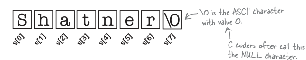

# cards_strings

Strings are just character arrays. When C sees a string like this:

```c
s = "Shatner"
```

it reads it like it was just an array of separate characters:

```c
s = {'S', 'h', 'a', 't', 'n', 'e', 'r'}
# This is how you define an array in C.
```

Each of the characters in the string is just an element in an array, which is why you can refer to the individual characters in the string by using an index, like s[0] and s[1].

## Don’t fall off the end of the string

But what happens when C wants to read the contents of the string? Say it wants to print it out. Now, in a lot of languages, the computer keeps pretty close track of the size of an array, but C is more low-level than most languages and can’t always work out exactly how long an array is. If C is going to display a string on the screen, it needs to know when it gets to the end of the character array. And it does this by adding a **sentinel character**.

The sentinel character is an additional character at the end of the string that has the value \0. Whenever the computer needs to read the contents of the string, it goes through the elements of the character array one at a time, until it reaches \0. That means that when the computer sees this:

```c
s = "Shatner"
```

it actually stores it in memory like this:


That’s why in our code we had to define the card_name variable like this:

```c
char card_name[3];
```

The card_name string is only ever going to record one or two characters, but because strings end in a sentinel character we have to allow for an extra character in the array.
